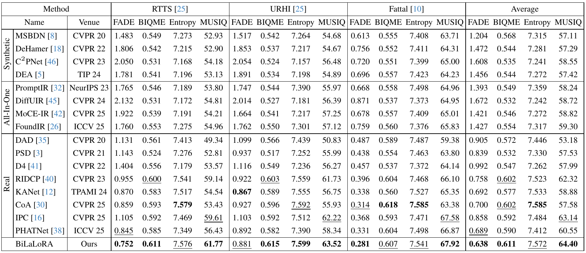

<div align="center">

<h1>Bilevel Layer-Positioning LoRA for Real Image Dehazing</h1>

<div>
    Yan Zhang</a>&emsp;
    Long Ma</a>&emsp;
    Yuxin Feng</a>&emsp;
    Zhe Huang</a>&emsp;
    Fan Zhou</a>&emsp;
    Zhuo Su</a>
</div>

<div>
    :star: <strong>Accepted to CVPR 2026
</div>

<div>
    <h4 align="center">
        <a href="https://arxiv.org/abs/2504.05590" target='_blank'>[arXiv]</a> •
        <a href="https://pan.baidu.com/s/1hINu3suhWb3wWVfUWoWlnQ?pwd=0519" target='_blank'>[Weight]</a>
    </h4>
</div>

</div>

## :mega: Updates
- **2026.03.09**: :fire::fire::fire: Training codes, and initial checkpoints are publicly available now.
- **2026.02.21**: :tada::tada::tada: Accepted by ***CVPR 2026***.


## :mag: Performance Comparison


## :pencil2: Results





## :desktop_computer: Environment

Step 1. Clone this repo:

```
git clone https://github.com/YanZhang-zy/CoA.git
cd CoA/
```

Step 2. Create a new conda environment and install dependencies:

```
conda create -n CoA python=3.10
conda activate CoA
conda install pytorch==2.2.0 torchvision==0.17.0 torchaudio==2.2.0 pytorch-cuda=11.8 -c pytorch -c nvidia
pip install -r requirements.txt
```

##  :book: Data Preparation

Step 1. Download the haze dataset from websites or papers.
Step 2. Make sure the file structure is consistent with the following:

```
dataset/
├── Synthetic_Data
│   ├── test
│   |   ├── clear
│   |   └── hazy
│   └── train
│       ├── clear
│       └── hazy
├── Real_Data
│   ├── 1.png
│   └── 2.png
│   └── 3.png
│   └── ...
```

The datasets can be downloaded at
+ [Reside](https://sites.google.com/view/reside-dehaze-datasets/reside-v0)
+ [Haze4K](https://pan.baidu.com/s/19stkJ3aaF8WgHK2FBytnZA?pwd=0411)
+ [RIDCP](https://github.com/RQ-Wu/RIDCP_dehazing)
+ [Real_Data](https://pan.baidu.com/s/1GS9qkwcBcKB411pdSwFcDg?pwd=0519)


## :hotsprings: Model Training
Step 1. Download the pre-trained model weight from [[BaiduPan](https://pan.baidu.com/s/1hINu3suhWb3wWVfUWoWlnQ?pwd=0519)].

Step 2. Make sure the file structure is consistent with the following:
```
model/
└── imagenet_model
    └── res2net101_v1b_26w_4s-0812c246.pth
clip_model/
├── haze_prompt.pth
├── RN101.pt
└── ViT-B-32.pt
```

Step 3. Run the following script to train CoA from scratch:
```
python Teacher.py
python KD.py
python EMA.py
```

## :taxi: Model Testing
Step 1. Download the pre-trained model weights from [[BaiduPan](https://pan.baidu.com/s/16WZ8FcMiY4JrkwxFy2yTLA?pwd=0214)].

Step 2. Make sure the file structure is consistent with the following:
```
model/
├── Teacher_model
│   └── Teacher.pth
├── Student_model
│   └── Student.pth
├── EMA_model
│   ├── EMA.pth
│   └── EMA_r.pth
```

Step 3. Run the following script to test BiLaLoRA:
```
python Eval.py
```

## :triangular_flag_on_post: Citation
If you find our paper and repo are helpful for your research, please consider citing:

```bibtex
@inproceedings{ma2025coa,
 author={Long Ma, Yuxin Feng, Yan Zhang, Jinyuan Liu, Weimin Wang, Guangyong Chen, Chengpei Xu, Zhuo Su},
 booktitle={Proceedings of the IEEE/CVF Conference on Computer Vision and Pattern Recognition (CVPR)},
 title={CoA: Towards Real Image Dehazing via Compression-and-Adaptation},
 year={2025}
}
```

## :mailbox_with_mail: Contacts 
If you have any questions or suggestions about this repo, please feel free to contact me (zhangy2779@mail2.sysu.edu.cn).
